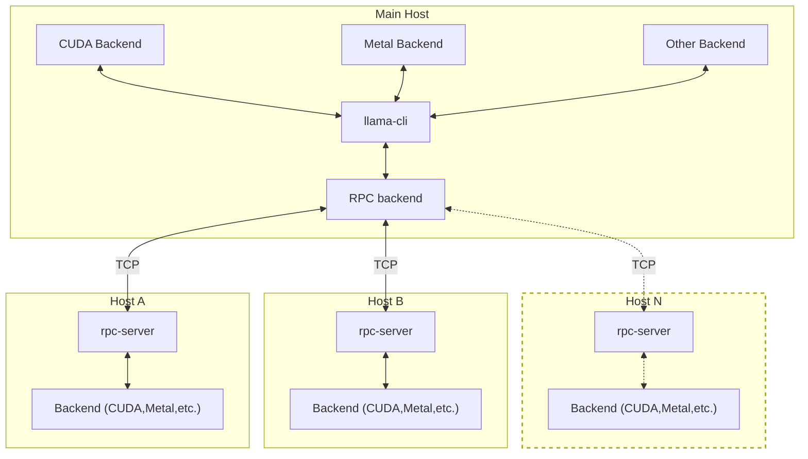

# llama.cpp

又幻想了，幻想自己可以轻松在本地部署大语言模型（Large Language Model），每秒输出 70+ tokens。
可是睁开眼却只能看见复杂的配置文档，或是经过无止尽的安装依赖和漫长等待后满屏的 OOM （Out of Memory）。

不想半途而废？那么 llama.cpp 可能是你最好的选择。

## 背景介绍

llama.cpp 是一个完全由 C 与 C++ 编写的轻量级推理框架，支持在 CPU 或 GPU 上高效运行 Meta 的 LLaMA 等大语言模型（LLM），**设计上尽可能减少外部依赖**，能够轻松在多种后端与平台上运行。

## 基础知识

### 安装 llama.cpp

你可以通过以下几种方式在设备上安装 llama.cpp：

#### 本地编译

```bash
git clone https://github.com/ggml-org/llama.cpp
cd llama.cpp

# CPU Backend
cmake -B build
cmake --build build --config Release
# cmake --build build --config Release -j 8 # -j 8 可加速编译过程，视你的 CPU 核心数而定

# CUDA Backend, require have CUDA toolkit: https://developer.nvidia.com/cuda-toolkit installed
cmake -B build -DGGML_CUDA=ON
cmake --build build --config Release
```

关于更详细的编译指导，可以查看参考文献中的 [Build](https://github.com/ggml-org/llama.cpp/blob/master/docs/build.md) 一节。

#### 使用包管理器安装

##### Homebrew

```
brew install llama.cpp
```

使用其他包管理器的同学，可以自行查找 llama.cpp 所使用的包名以安装。

#### Docker

还可以使用 llama.cpp 提供的 Docker 镜像来直接运行 LLM。其主要提供的镜像种类有：
  - `ghcr.io/ggml-org/llama.cpp:full`：包含了用于运行 LLM 和转换/量化模型的可执行文件，
  - `ghcr.io/ggml-org/llama.cpp:light`：仅包含了用于运行 LLM 的可执行文件，
  - `ghcr.io/ggml-org/llama.cpp:server`：包含了用于在服务器端部署 LLM 服务的可执行文件。
  - 此外还有能与 CUDA 等后端协作的 Docker 镜像，具体可以参考相关文档.

需要注意的是，此种方式并不适合性能分析、分布式部署等需求。

### 使用

你可以使用 llama-cli, llama-run, llama-simple 来与部署的 LLM 进行交互，

[llama-cli](https://github.com/ggml-org/llama.cpp/tree/master/tools/main)：**主要的命令行推理工具**，用于加载模型、输入 prompt 并直接在终端交互式生成文本。适合单条 prompt 测试和参数调优。可进入交互模式也可指定 prompt 进行一次性推理。
[llama-run](https://github.com/ggml-org/llama.cpp/tree/master/tools/run)：简化版的推理入口，可以指定 prompt、输出 token 数量等，是**非交互**、一次性推理的工具。
[llama-simple](https://github.com/ggml-org/llama.cpp/tree/master/examples/simple)：llama.cpp 提供的最简推理示例程序，仅演示如何用 C++ API 加载模型并生成文本。用于开发者学习 llama.cpp 的接口用法。

```bash
# 进入 llama.cpp/build/bin 目录 cd llama.cpp/build/bin
./llama-cli -m ./models/llama-7b.gguf   # 交互模式
./llama-cli -m ./models/llama-7b.gguf -p "What is a large language model?" -n 100 # 一次性推理，生成 100 个 token

./llama-run -m ./models/llama-7b.gguf -p "Explain what is Reinforcement Learning" -n 100 --temp 0.7   # 一次性推理，生成 100 个 token，温度为 0.7

# 使用 llama-simple 进行简单推理
./llama-simple -m ./models/llama-7b.gguf "Hello, my name is"
```

llama.cpp 所支持的模型列表可以在[这里](https://github.com/ggml-org/llama.cpp?tab=readme-ov-file#text-only)找到，我们推荐首先尝试较为主流的 LLaMA 2、LLaMA 3、 Mistral、Qwen、ChatGLM 等系列模型。

常见的 LLM 模型大小有 1B、7B、13B 等，一般来说，模型规模越大，生成的质量越好，但是推理时所需内存也会随之增长。为避免频繁出现 OOM 的现象，我们推荐从较小的 LLM 开始调试。

### 分布式部署

除了大部分计算架构的后端，
llama.cpp 还通过 RPC 后端的设计允许多个不同架构、不同平台的设备在一起提供算力，这使得在家用设备上分布式部署并推理大规模 LLM 成为可能。

以下是 llama.cpp 通过 RPC 后端进行分布式推理的架构示意图，
**从机**上运行本地计算后端（例如 CUDA、Metal等），通过 rpc-server 与**主机**上的 RPC 后端进行 TCP 通信来提供推理算力支持。将多个设备的算力与内存结合起来，实现分布式推理。




以下是启用分布式部署、推理功能的简短示例，在编译时还应加上对应后端的编译选项。
**此功能目前仍在测试中，请谨慎使用。**

```bash
# 在每台机器上编译支持 RPC 的 llama.cpp
mkdir build-rpc-cuda
cd build-rpc-cuda
cmake .. -DGGML_RPC=ON  #-DGGML_CUDA=ON, -DGGML_METAL=ON, ...
cmake --build . --config Release

# 在从机上启动 rpc-server 与对应后端
$ bin/rpc-server -p 50052

# 在主机上启动使用 RPC 的 llama-cli，
$ bin/llama-cli -m [model_path] -p [prompt] --rpc 192.168.88.10:50052,192.168.88.11:50052,...
```

### 部署常用参数

以下是一些在使用 llama.cpp 部署 LLM 时**常见参数**的解释：

<!-- 【在本实验中，我们主要关注 llama.cpp 的性能与承载能力方面。】
【与性能有关的常见参数解释】 -->

| 常用参数                | 作用说明                                                         | 示例                         |
|---------------------|------------------------------------------------------------------|------------------------------|
| `-m [model_path]`   | 指定模型文件路径                                                 | `-m ./models/llama-7b.gguf`  |
| `-p [prompt]`       | 指定输入的 prompt 内容                                           | `-p "你好，介绍一下LLM"`      |
| `-n [num_tokens]`   | 生成的 token 数量                                               | `-n 100`                     |
| `--ctx-size [N]`    | 上下文窗口大小（token 数）                                       | `--ctx-size 2048`            |
| `--temp [T]`        | 采样温度，控制生成多样性（0~2，越大越随机）                      | `--temp 0.7`                 |

你可以通过 `./llama-cli --help` 查看所有支持的参数和详细说明。

| 性能参数                              | 类型    | 含义                                | 说明与建议                                                           |
| ------------------------------- | ----- | --------------------------------- | --------------------------------------------------------------- |
| `--threads`                     | int   | 推理时使用的线程数（多线程并行）                  | 建议设为物理核心数，例如 8 核 CPU 可设为 `--threads 8`，提升 CPU 推理效率              |
| `--batch-size`                  | int   | 每轮并行处理的 token 数                   | 增大可减少评估调用次数，提高吞吐（适用于 CPU 或小模型）                                  |
| `--ctx-size`                    | int   | 上下文窗口大小（token）                    | 默认 512，建议设为 `2048~4096`，可支持更长输入但增加显存/内存压力                       |
| `--n-gpu-layers`                | int   | 加载到 GPU 的 transformer 层数          | 配合 `llama.cpp` 编译的 CUDA/OpenCL 版本使用，设为 `0` 表示纯 CPU 推理；合理使用可大幅加速 |
| `--no-mmap`                    | flag  | 禁止使用 mmap 加载模型                      | 加上 --no-mmap 后，模型会被完整读入内存（不是映射），这样加载速度会变慢，但在某些情况下（比如没有使用 --mlock 锁定内存时），可以减少页面换出（pageout）导致的性能抖动                              |
| `--repeat-penalty`              | float | 控制重复内容惩罚（影响输出内容质量）            | 设置较高可避免冗长重复，但处理复杂度略升                                            |


### 性能评估与优化

在部署 llama.cpp 后，理解和优化其性能是实验的关键一环。这不仅涉及模型的运行速度，还包括其生成内容的质量。

你可以使用 llama-bench, llama-perplexity 对 LLM 的推理性能以及生成质量进行评估。

[llama-bench](https://github.com/ggml-org/llama.cpp/blob/master/tools/llama-bench)：用于评估模型在不同配置下的吞吐率（tokens/s）。

[llama-perplexity](https://github.com/ggml-org/llama.cpp/blob/master/tools/perplexity)：用于计算给定数据集的困惑度（Perplexity），衡量语言建模质量。

???+info "提示"

    困惑度：困惑度是衡量语言模型预测能力的指标，数值越低表示模型对文本的预测越准确（即“困惑”越少）

除了 llama-bench (用于评估吞吐率，即每秒生成token数) 和 llama-perplexity (用于计算困惑度，衡量语言建模质量) 之外，我们还可以关注以下指标：


**首次token生成延迟**: 用户输入后，模型生成第一个token所需的时间。这直接影响用户体验的响应速度。
**总生成延迟**: 从用户输入到模型完成所有输出所需的时间。
**显存占用**: 模型在GPU上运行时占用的显存大小。对于资源有限的设备至关重要。
**流畅度与相关性**: 通过人工评估或自动评估指标（如 BERTScore，用于衡量生成文本与参考文本的语义相似性）来判断模型输出是否自然、连贯，并与输入提示相关。
**多样性**: 衡量生成文本中避免重复和具备丰富表达的能力。

等等。以上评估指标供参考，你也可以选择其他指标，合理即可。


针对你给出的性能指标和评估结果，我们要求你给出合理的优化方案，并初步实现，下面是一些可能的方法，仅供参考。

> 硬件加速与后端配置:
???+info "提示"

    充分利用硬件资源是提升性能的关键。

**GPU 加速**: 如果有GPU，编译 llama.cpp 时启用GPU支持（如 LLAMA_CUBLAS=1 for NVIDIA），并使用 --ngl 参数将模型层加载到GPU上。尝试不同的 ngl 值（例如 -1 表示所有层）以找到性能与显存占用的最佳平衡。
**CPU 优化**: 即使只使用CPU，也可以通过编译时启用AVX/AVX2/AVX512等指令集优化，并调整 --threads 参数来优化CPU核心的利用率。

> 推理参数调整:
???+info "提示"

    调整推理参数可以影响生成过程和结果。

**上下文窗口大小**: 增加上下文大小可以处理更长的输入，但会增加内存和计算开销。
**采样策略**：如 --temp, --top-k, --top-p: 调整这些参数可以控制生成文本的随机性和多样性，从而影响生成质量。
**Batch Size**：--batch-size 适当增加批处理大小可以提高吞吐率，但可能会增加延迟和显存占用。

注意：本次实验并不需要你做出特别复杂的优化，尝试这些优化手段，得到一个进步的结果即可，没有必要追求SOTA（state of the art）的结果。我们也不鼓励为了得到更极限的结果而大批量调参。

## 参考资料

https://github.com/ggml-org/llama.cpp

## 番外

本实验原本预期添加有关于 vllm 的内容，但是 llama.cpp 更酷一些！
