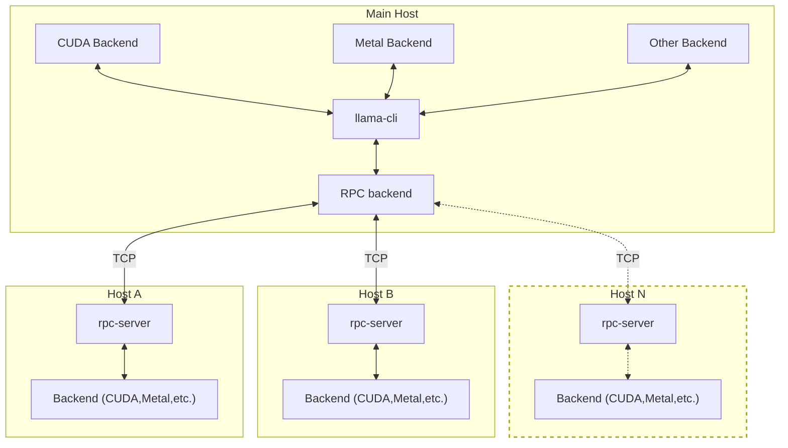

# llama.cpp
又幻想了，幻想自己可以轻松在本地部署大语言模型（Large Language Model），每秒输出 70+ tokens。
可是睁开眼却只能看见复杂的配置文档，或是经过无止尽的安装依赖和漫长等待后满屏的 OOM （Out of Memory）。

不想半途而废？那么 llama.cpp 可能是你最好的选择。

## 背景介绍
llama.cpp 是一个轻量级的 LLM 推理框架，旨在通过最少的准备工作实现 LLM 的高性能推理。
它完全使用 C 与 C++ 语言实现，且无任何依赖项，能够轻松地与各类架构、后端一同运行。

## 基础知识
### 安装 llama.cpp
你可以通过以下几种方式在设备上安装 llama.cpp：
#### 本地编译

```
git clone https://github.com/ggml-org/llama.cpp
cd llama.cpp

# CPU Backend
cmake -B build
cmake --build build --config Release

# CUDA Backend, require have CUDA toolkit: https://developer.nvidia.com/cuda-toolkit installed
cmake -B build -DGGML_CUDA=ON
cmake --build build --config Release
```

关于更详细的编译指导，可以查看参考文献中的 Build 一节。

#### 使用包管理器安装
##### Homebrew
```
brew install llama.cpp
```

使用其他包管理器的同学，可以自行查找 llama.cpp 所使用的包名以安装。

#### Docker
还可以使用 llama.cpp 提供的 Docker 镜像来直接运行 LLM。其主要提供的镜像种类有：
  - `ghcr.io/ggml-org/llama.cpp:full`：包含了用于运行 LLM 和转换/量化模型的可执行文件，
  - `ghcr.io/ggml-org/llama.cpp:light`：仅包含了用于运行 LLM 的可执行文件，
  - `ghcr.io/ggml-org/llama.cpp:server`：包含了用于在服务器端部署 LLM 服务的可执行文件。
  - 此外还有能与 CUDA 等后端协作的 Docker 镜像，具体可以参考相关文档.

需要注意的是，此种方式并不适合性能分析、分布式部署等需求。

### 使用
你可以使用 [llama-cli](https://github.com/ggml-org/llama.cpp/tree/master/tools/main),
[llama-run](https://github.com/ggml-org/llama.cpp/tree/master/tools/run), [llama-simple](https://github.com/ggml-org/llama.cpp/tree/master/examples/simple)来与部署的 LLM 进行交互，

llama.cpp 所支持的模型列表可以在[这里](https://github.com/ggml-org/llama.cpp?tab=readme-ov-file#text-only)找到，我们推荐首先尝试较为主流的 LLaMA 2、LLaMA 3、 Mistral、Qwen、ChatGLM 等系列模型。

常见的 LLM 模型大小有 1B、7B、13B 等，一般来说，模型规模越大，生成的质量越好，但是推理时所需内存也会随之增长。为避免频繁出现 OOM 的现象，我们推荐从较小的 LLM 开始调试。


### TODO NOT DONE FROM HERE
### 分布式部署
除了大部分计算架构的后端，
llama.cpp 还通过 RPC 后端的设计允许多个不同架构、不同平台的设备在一起提供算力，这使得在家用设备上分布式部署并推理大规模 LLM 成为可能。

以下是 llama.cpp 通过 RPC 后端进行分布式推理的架构示意图，
通过在机器上运行 rpc-server 和本地后端（例如 CUDA、Metal等）与主机上的 RPC 后端通过 TCP 进行通信
主机上运行 RPC 后端，
**此功能目前仍在测试中，请谨慎使用。**



【RPC架构描述 - https://github.com/ggml-org/llama.cpp/tree/master/tools/rpc】

【RPC教程 - 编译带RPC的版本，其他host运行rpc-server，main host运行添加rpc参数】

### 性能评估以及优化
你还可以使用 [llama-bench](https://github.com/ggml-org/llama.cpp/blob/master/tools/llama-bench), [llama-perplexity](https://github.com/ggml-org/llama.cpp/blob/master/tools/perplexity) 对 LLM 的推理性能以及生成质量进行评估。

以下是一些在使用 llama.cpp 部署 LLM 时相关常见参数的解释：
【在本实验中，我们主要关注 llama.cpp 的性能与承载能力方面。】
【与性能有关的常见参数解释】

## 参考资料
https://github.com/ggml-org/llama.cpp

https://github.com/ggml-org/llama.cpp/blob/master/docs/build.md

https://github.com/ggml-org/llama.cpp/tree/master/tools/rpc


## 番外
本实验原本预期添加有关于 vllm 的内容，但是 llama.cpp 更酷一些！